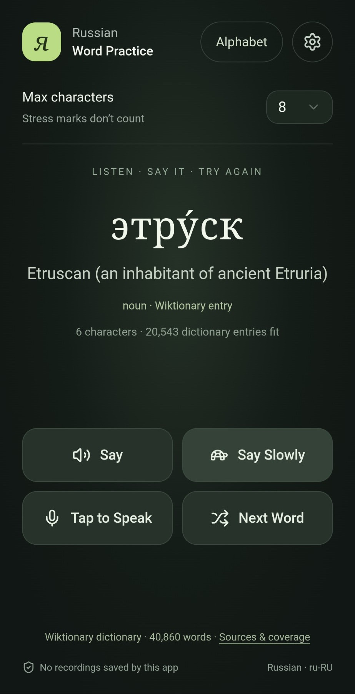
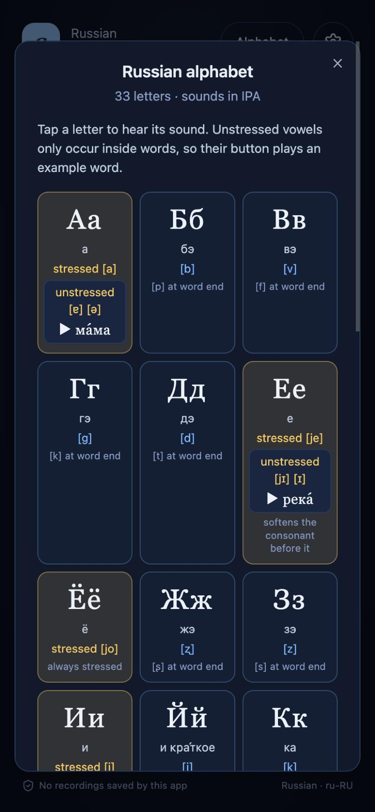

# Russian Word Practice

An installable web app (PWA) for practising Russian pronunciation, one word at a time. Live at <https://russian-practice.fly.dev>.

- **Wiktionary dictionary**: 40,860 words with stress marks, English meanings and Wiktionary links, picked at random for each Next Word. Choose a maximum word length from 1 to 32 letters.
- **Say / Say Slowly**: hear the word from an Azure neural voice (Svetlana or Dmitry), at normal or half speed.
- **Tap to Speak**: tap, wait for "Speak now", and say the word. Recording stops by itself about a second after you finish (or tap again), and you get an approximate Azure pronunciation score.
- **Alphabet**: the 33 letters in standard order with their names and IPA sounds. Tap a letter to hear its sound. Vowels also show their unstressed (reduced) sound, played inside an example word such as ма́ма or молоко́.

<p align="center">
  
  
</p>

There is no backend or shared account. Each person uses their **own Azure Speech key (East US)**. The browser talks to Microsoft Azure directly, and the key never reaches the app's host.

## Getting started

1. Create an Azure Speech resource in **East US** and copy one of its keys.
2. Open the app, tap **Say** (or the settings icon), and paste the key.
3. Keep **Remember my key on this device** ticked, approve the Azure requests, enable Azure calls and save. You only do this once per device. **Forget key on this device** removes everything.

Azure bills your account for speech use. The app does not limit requests, so use Azure quotas and budgets to cap spending.

## Development

Requires Node 24 to build and test; production serves static files only.

```sh
npm ci
npm run dev        # local dev server
npm run typecheck
npm test
npm run build
```

The official instance is a static build served by nginx on Fly.io (app `russian-practice`, Toronto `yyz`). To host your own, see [Deploy your own copy](#deploy-your-own-copy).

```sh
fly deploy --app russian-practice --primary-region yyz --regions yyz --remote-only
```

`npm start` runs Vite’s local preview; it is not the production server. Docker uses unprivileged nginx on port 8080. No Python is needed to build, serve or use the app. The optional historical dictionary importer is Python, used only when replacing the source dataset.

Test suites (`npm test`):

- `tests/core.test.mjs`: PCM bounds, scoring, SSML and alphabet data (order, Azure-supported sounds, example words)
- `tests/dictionary.test.mjs`: full dictionary counts, licensing/provenance, stress and selection coverage
- `tests/client.test.mjs`: direct token destination/header, key and approval storage, SDK cleanup, cancellation, Azure error details, no local request limit and Fly config
- `tests/full-dictionary.test.mjs`: one-download coverage, offline selection, worker cancellation, timeouts, retry, corrupt cache, quota failure and content-version replacement
- `tests/lifecycle.test.mjs`: remembered setup across reloads, Forget, tap-to-speak (auto-stop after the word, second-tap cancel and stop, too-short clips, 8-second stop, live-mic detection, mic opened before the audio engine, Bluetooth hint), mocked denied microphone, late permissions/results, playback recovery, Alphabet playback and caching, Next/Cancel, failed dictionary selection and rapid length changes

## Architecture

A static, multi-user Russian pronunciation PWA. React + TypeScript in the browser; nginx serves built files on Fly.io. **No application backend, shared user account, server-side Azure key, database or volume.** Each person supplies their own Azure Speech key on their device and contacts Microsoft Azure directly.

## Feature details

- 41,231 spelling/stress entries, 40,860 distinct spellings, randomized by maximum length (1–32 Cyrillic letters), with no immediate repeat of the same spelling
- English meaning, canonical stress, Wiktionary source links, sourced IPA used for synthesis
- The stressed vowel is highlighted in the word; scores are coloured green (80+), amber (60–79) or coral (below 60); in the Alphabet, vowels are amber (like the stressed vowel) and consonants blue
- Svetlana/Dmitry Russian neural voices; normal and half-speed (Say Slowly) speech. Each clip starts with a 250ms pause so phones don't clip the first sound
- Alphabet panel: the 33 letters in standard order with names and IPA; tapping a letter plays its sound (consonants with a short neutral vowel, as in "buh"). Vowels also show their unstressed sound, played inside a common example word, because Azure voices an isolated reduced vowel as a full one
- Generated speech is kept in memory for the session, so replaying a word or letter does not call Azure again
- When Azure refuses a request, the app shows Azure's own reason (query strings stripped) instead of a generic error
- Tap to Speak records up to eight seconds of microphone audio. "Speak now" appears once the mic is actually live, which matters for Bluetooth headsets. Recording stops by itself after about 0.8 s of quiet following the word (or on a second tap); the silence is trimmed and the clip submitted. Too-short clips are not sent, and Next/Cancel discard the clip. The audio engine is created after the microphone opens, so a Bluetooth headset that switched to its call profile is already the active device. A Bluetooth headset mic records at phone-call quality, so the app suggests the phone's own mic when Azure is unsure
- Conservative Azure pronunciation estimates, not a Russian stress or individual-phoneme diagnosis. The score is shown even when Azure is unsure which word it heard (common for one learner word), marked as rough; if Azure does not answer within 20 seconds, the app says so
- Installable mobile PWA with a dictionary-only local cache; no persistent audio/score cache or offline speech library

## Credentials and privacy

1. Open Settings and enter **your own Azure Speech key for East US**. Never enter a key into a public repository, chat, build variable, Fly secret or deployment command.
2. With Remember unchecked, the key, consent and enabling of Azure calls stay only in browser memory; reloading/closing the app loses them.
3. **Remember my key on this device** (checked by default) stores the key, and whether Azure calls were approved and enabled, in this origin’s browser local storage, so setup is needed once per device. This is not encrypted: app JavaScript, compromised same-origin code, browser extensions or anyone with access to that browser profile may read it. Do not use this on a shared device. Browser/device backups and synchronization are outside the app’s control.
4. The long-lived key goes directly to `https://eastus.api.cognitive.microsoft.com/sts/v1.0/issueToken` in the subscription-key header. It never goes to Fly or an app API. The SDK receives only the short-lived Azure token, held in memory.
5. Browsers cannot add custom WebSocket authorization headers. Microsoft’s SDK places the short-lived token in the **Azure-only WSS connection URL**, visible in browser developer tools and potentially Azure infrastructure logs. The raw subscription key is not supplied to the SDK or placed in a URL.
6. TTS words and submitted audio go directly to Microsoft’s fixed East US Speech endpoints. SDK telemetry is disabled. The app has no analytics, payload logging, audio storage or score storage. Azure’s own processing, billing and retention policies still apply.
7. Forget key removes the app’s remembered key and approval and clears memory. Rotate the key in Azure for revocation. Requests already submitted can still finish after cancellation.

The app does not limit how many speech requests you make. Use Azure resource quotas and billing controls for account-level protection; provider billing is determined by Azure.

The website and this repository are public and contain no credentials. Client-side Azure authentication controls access to each user’s Azure resource, not access to the website.

## Deploy your own copy

The app is a static site, so any static host works. The repository includes a Dockerfile (unprivileged nginx on port 8080) and a `fly.toml` for [Fly.io](https://fly.io). The official instance runs as the Fly app `russian-practice` on two shared-CPU 256MB machines in Toronto (`yyz`), so deploys roll over without downtime and one machine keeps serving if the other's host fails.

To run your own on Fly:

1. Install the Fly CLI and sign in with `fly auth login`.
2. Create an app with your own name, for example `fly apps create my-russian-practice`, and set `app` (and, if you like, `primary_region`) in `fly.toml`.
3. Deploy: `fly deploy --app my-russian-practice`. Fly creates two machines by default; add `--ha=false` for one if you don't need zero-downtime deploys. A shared IPv4/IPv6 address is enough; you don't need a dedicated IPv4.
4. Open the app's HTTPS URL, set up your Azure key and try Say and Tap to Speak.

`fly.toml` lets machines stop when idle and start on the next request, so a second machine mostly costs its stopped storage:

```toml
auto_stop_machines = "stop"
auto_start_machines = true
min_machines_running = 0
```

There are **no volumes, Fly secrets, keepalive jobs or always-on machines**, and no server-side configuration: each user enters their own Azure key in the browser. Don't add an external uptime ping, since it would keep waking the machine.

## Hosting estimate

Fly’s [October 1, 2026 pricing update](https://fly.io/pricing-update/) lists the default-region shared-CPU 256MB machine at $0.003/hour, or $2.19 for 730 active hours. Thirty active hours would be about $0.09 of compute; with auto-stop, light traffic usually wakes only one of the two machines. Stopped root filesystem storage is separately $0.15/GB-month; North America/Europe egress is $0.02/GB. Actual region, image size, traffic, taxes and account terms affect the bill. There is no promised free tier or hard monthly cap. Azure Speech usage is separate.

## Dictionary

Dictionary data and adaptations are CC BY-SA 4.0, attributed to English Wiktionary contributors via Kaikki/Wiktextract. Exact snapshot, input hash, transformations and counts are in `public/dictionary-attribution.json`; each entry links to Wiktionary. The source dump dates to September 2, 2026; extraction October 3, 2026. The UI links the license and offers the adapted JSON download.

All 442,594 source records were considered. Lowercase single-word lemmas with matching English gloss, lexical stress and supported IPA were retained; names, phrases, inflected-only records and unsuitable senses were excluded. This is broad vocabulary, not the whole Russian language or a curated course. Phonetic adaptations have not been listening-validated.

Build generation creates one complete content-hashed gzip archive (1,814,163 bytes; 41,231 entries / 40,860 distinct spellings). The app downloads it once at startup, checks its SHA-256 and counts, decompresses and parses it in a dedicated Web Worker, then saves the verified compressed bytes in a dictionary-only CacheStorage cache. Later page loads use that local copy without a dictionary network request. Browser storage can be cleared or evicted; if storage is denied/full, the current tab still works and the status explains that another visit will need a download. Updating the dictionary changes its content hash and triggers a fresh whole-corpus download.

Next and maximum-letter changes select entirely from the worker's in-memory dictionary, uniformly across eligible entries while excluding all variants of the previous spelling. They do not fetch more sections. Concurrent selections share the startup download; cancelling a selection does not restart it. Download progress, errors and storage warnings are shown under the buttons; the status line disappears once the dictionary is ready. A stalled download times out after 60 seconds; Next retries. Interrupted or corrupt data is never saved; a corrupt saved copy is replaced. Modern HTTPS browsers with module workers, Web Crypto and DecompressionStream are required.

Only the public dictionary is persisted by this feature. The service worker remains network-only and cannot cache Azure requests, audio, tokens or credentials. The already-open app can select words offline; offline page launch is not promised, and Azure speech needs a connection. Key storage is controlled separately by Remember. The Azure SDK still loads only for a speech request. The adapted JSON is also available as an explicit download.

## Verification

TypeScript, production bundling and automated tests run without real credentials, microphone audio or billed Azure requests. Browser checks used a simulated Azure WebSocket to exercise the real SDK, and the Azure token endpoint's CORS preflight returns HTTP 200 without credentials. The live Fly deployment serves the app. The owner has confirmed Say, Say Slowly, Tap to Speak scoring, a remembered key and the Alphabet on an Android phone with a real key. Azure pronunciation quality and each letter's synthesized sound still rely on listening checks.

Official references: [Azure Speech SDK JavaScript](https://github.com/microsoft/cognitive-services-speech-sdk-js), [Azure browser synthesis sample](https://github.com/Azure-Samples/cognitive-services-speech-sdk/blob/master/samples/js/browser/synthesis.html), [Azure token authentication](https://learn.microsoft.com/en-us/azure/ai-services/speech-service/rest-text-to-speech#authentication), [Fly autostop/autostart](https://fly.io/docs/reference/fly-proxy-autostop-autostart/).

## License

The source code is released under the [MIT License](LICENSE). © 2026 Andre Paquette.

Other material keeps its own license:

- **Dictionary data** (`public/dictionary*`, `lib/dictionary-data.mjs`) is adapted from English Wiktionary via Kaikki.org/Wiktextract under [CC BY-SA 4.0](https://creativecommons.org/licenses/by-sa/4.0/). Attribution and provenance are in `public/dictionary-attribution.json`.
- **UI components** derived from shadcn/ui are MIT-licensed. See [vendor/shadcn-tailwind-4.13.0.LICENSE.md](vendor/shadcn-tailwind-4.13.0.LICENSE.md).
- **Speech** is generated by Microsoft Azure under your own Azure account and Microsoft's terms.

## Security

Please report vulnerabilities privately; see [SECURITY.md](SECURITY.md).
